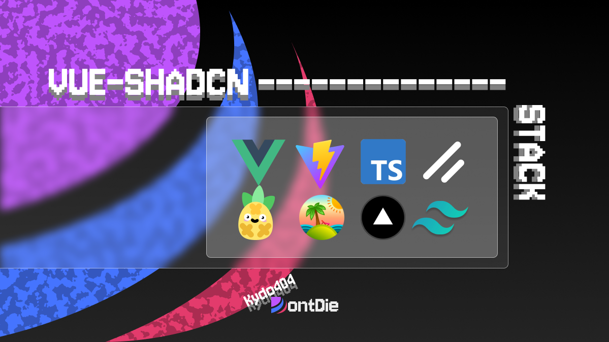

# Shadcn Vue Admin

[](https://github.com/antfu/eslint-config)

Admin Dashboard UI crafted with Shadcn-vue, Vue3 and Vite. Built with responsiveness and accessibility in mind.



## Features
- [x] Light/Dark Mode
- [x] Global Search Command
- [x] shadcn-ui sidebar
- [x] some custom components
- [x] auto generate routes
- [x] 8+ pages

## Tech Stack
ui:
  - [inspira-ui](https://inspira-ui.com/components/box-reveal)
  - [shadcn-vue](https://www.shadcn-vue.com)

Build Tool:
  - [Vite](https://cn.vitejs.dev/)

State Management:
  - [pinia](https://pinia.vuejs.org/api/pinia/)
  - [persistedstate](https://prazdevs.github.io/pinia-plugin-persistedstate/guide/limitations.html)

Styling:
  - [Tailwind CSS](https://tailwindcss.com/)

Unplugins:
  - [Auto Import](https://github.com/antfu/unplugin-auto-import)
  - [Components](https://github.com/antfu/unplugin-vue-components)
  - [vite-plugin-pages](https://github.com/hannoeru/vite-plugin-pages) [Deprecation]
  - [unplugin-vue-router](https://github.com/posva/unplugin-vue-router)
  - [Vite Plugin Vue Layouts](https://github.com/JohnCampionJr/vite-plugin-vue-layouts)
  - [Vite Plugin Vue Devtools](https://github.com/webfansplz/vite-plugin-vue-devtools)

Icons:
  - [Lucide](https://lucide.dev/)

Linting:
  - [ESLint](https://eslint.org/)
  - [antfu/eslint-config](https://github.com/antfu/eslint-config)

Charts:
  - [vue-chrts](https://github.com/dennisadriaans/vue-chrts)
> If you use tailwindcss v4, shadcn-vue charts is 'Legacy'. We now use this library instead.

## Run locally
clone the project

Go to the project directory
```bash
cd shadcn-vue-admin
```

Install dependencies
```bash
pnpm install
```

Start the development server
```bash
pnpm dev
```
## Tips

### Theme Customization
If you need to change the website style, you can use the preset styles provided by [tweakcn](https://tweakcn.com/editor/theme). You only need to copy the css variables provided by tweakcn to `index.css` and change the `:root` `:dark` and `@theme inline` parts.

### No `index.vue` in nested directories and don't want to use the default layout
For example, I don't want the pages in the `pages/errors/` and `pages/auth/` folders to use the default layout. I need to create a file in `pages/` with the same name as the directory, `src/pages/errors.vue` `src/pages/auth.vue`, with the following file contents.
```vue
<template>
  <router-view />
</template>

<route lang="yml">
  meta:
    layout: false # This is the layout you want. I use false here to indicate that it does not need layout components.
</route>
```

> This will result in an extra route being generated. In this example, if you follow the above steps, redundant `/error/` and `/auth/` routes will be generated, and these two pages will be blank pages.
> If you don't need them and there is no `index.vue` in the directory, you can create an `index.vue` file in the directory and redirect it to any page.
> I redirect it to `/errors/404` here, you can handle it according to your situation. The content of the `index.vue` file is as follows:
```vue
<script lang="ts" setup>
const router = useRouter()
router.replace({ name: '/errors/404' })
</script>
```
